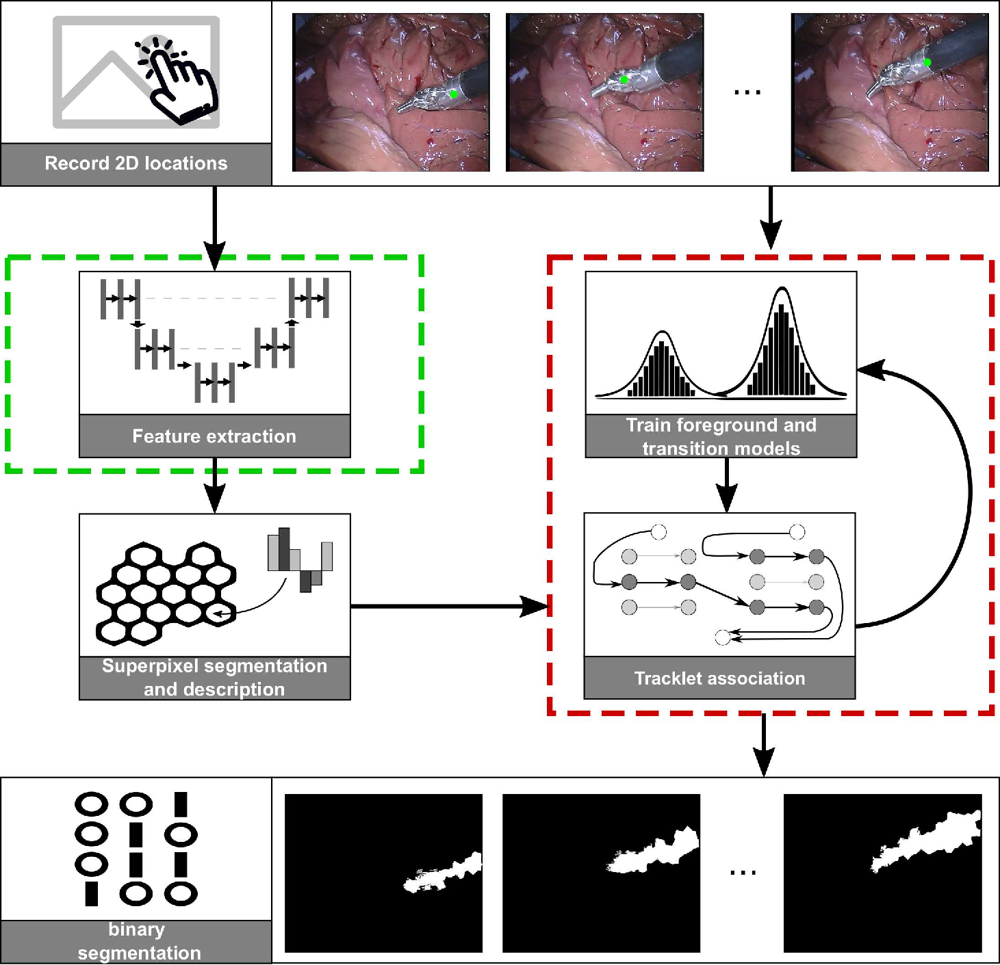

## Synopsis

KSPTrack is a method for the segmentation of video and volumetric sequences
with sparse point supervision.



## Installation

This software depends on the following independent components that you will have
to install first.
Both make use of the [C++ boost library](https://www.boost.org).
The installation procedure are given in the respective github repositories
as well as here for convenience.

We also provide a docker image that includes all requirements below at [lejeunel/boost](https://hub.docker.com/r/lejeunel/ksptrack/).

### [SLIC Supervoxels](https://github.com/lejeunel/SLICsupervoxels)
simple and efficient supervoxels.

```
git clone https://github.com/lejeunel/SLICsupervoxels
cd SLICsupervoxels
mkdir build
cd build
cmake ..
make
python3 src/setup.py install
```

### [Edge-disjoint K-shortest paths](https://github.com/lejeunel/boost_ksp)
C++ implementation. Uses the boost graph library.

```
git clone https://github.com/lejeunel/boost_ksp
cd boost_ksp
mkdir build
cd build
cmake ..
make
python3 src/setup.py install
```

### Install the whole thing
Once both external dependencies are installed, procede to the current package:
```
git clone https://github.com/lejeunel/KSPTrack
cd KSPTrack
pip install .
pip install -r requirements.txt
```

## Usage
All parameters used in this program are set in `cfgs/cfg.py`.

We provide two files depending on the availability of GPU:

- `single_ksp.py`: Uses a pre-trained VGG16 for feature-extraction. It requires no GPU.
- `single_ksp_gpu.py`: Trains and extracts features from a U-Net. It requires a GPU.
